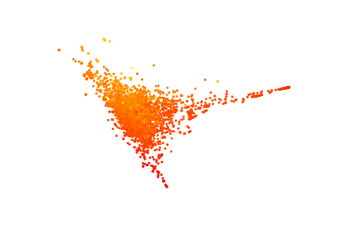

<p align="left">
  
</p>

# ASAP 
Automatic Selection And Prediction tools for materials and molecules

[](https://zenodo.org/badge/latestdoi/201763628)

### [Documentation](https://bingqingcheng.github.io/index.html) (in progress)

### Mapping Materials and Molecules [(Paper link)](https://pubs.acs.org/doi/full/10.1021/acs.accounts.0c00403)

Cheng B, Griffiths RR, Wengert S, Kunkel C, Stenczel T, Zhu B, Deringer VL, Bernstein N, Margraf JT, Reuter K, Csanyi G. Mapping Materials and Molecules. Accounts of Chemical Research. 2020 Aug 14:12697-705.

This tutorial style paper covers:

* A concise summary of the theory of representing chemical environments, an a simple yet practical conceptual approach for generating structure maps in a generic and automated manner. 

* Several illustrative examples on mapping material and chemical datasets, including crystalline and amorphous materials, interfaces, and organic molecules. The datasets of these examples are in this [repo](https://github.com/BingqingCheng/Mapping-the-space-of-materials-and-molecules).

* Snippets of `asap` commands that were used to analyze the examples and make figures. 

### Basic usage

Type `asap` and use the sub-commands for various tasks.

To get help string:

`asap --help` .or. `asap subcommand --help` .or. `asap subcommand subcommand --help` depending which level of help you are interested in.

* `asap gen_desc`: generate global or atomic descriptors based on the input [ASE](https://wiki.fysik.dtu.dk/ase/ase/atoms.html)) xyze file. 

* `asap map`: make 2D plots using the specified design matrix. Currently PCA `pca`, sparsified kernel PCA `skpca`, UMAP `umap`, and t-SNE `tsne` are implemented. 

* `asap cluster`: perform density based clustering. Currently supports DBSCAN `dbscan` and [Fast search of density peaks](https://science.sciencemag.org/content/344/6191/1492) `fdb`.

* `asap fit`: fast fit ridge regression `ridge` or sparsified kernel ridge regression model `kernelridge` based on the input design matrix and labels.

* `asap kde`: quick kernel density estimation on the design matrix. Several versions of kde available.

* `asap select`: select a subset of frames using sparsification algorithms.

### Quick & basic example

#### Step 1: generate a design matrix

The first step for a machine-learning analysis or visualization is to generate a "design matrix" made from either global descriptors or atomic descriptors. To do this, we supply `asap gen_desc` with an input file that contains the atomic coordintes. Many formats are supported; anything can be read using [ase.io](https://wiki.fysik.dtu.dk/ase/ase/io/io.html) is supported. You can use a wildcard to specify the list of input files that matches the pattern (e.g. `POSCAR*`, `H*`, or `*.cif`). However, it is most robust if you use an extended xyz file format (units in angstrom, additional info and cell size in the comment line).

As a quick example, in the folder ./tests/

to generate SOAP descriptors:

```bash
asap gen_desc --fxyz small_molecules-1000.xyz soap
```

for columb matrix:

```bash
asap gen_desc -f small_molecules-1000.xyz --no-periodic cm
```

#### Step 2: generate a low-dimensional map

After generating the descriptors, one can make a two-dimensional map (`asap map`), or regression model (`asap fit`), or clustering (`asap cluster`), or select a subset of frames (`asap select`), or do a clustering analysis (`asap cluster`), or estimate the probablity of observing each sample (`asap kde`).

For instance, to make a pca map:

```bash
asap map -f small_molecules-SOAP.xyz -dm '[SOAP-n4-l3-c1.9-g0.23]' -c dft_formation_energy_per_atom_in_eV pca
```

You can specify a list of descriptor vectors to include in the design matrix, e.g. `'[SOAP-n4-l3-c1.9-g0.23, SOAP-n8-l3-c5.0-g0.3]'`

one can use a wildcard to specify the name of all the descriptors to use for the design matrix, e.g.

```bash
asap map -f small_molecules-SOAP.xyz -dm '[SOAP*]' -c dft_formation_energy_per_atom_in_eV pca
```

or even

```bash
asap map -f small_molecules-SOAP.xyz -dm '[*]' -c dft_formation_energy_per_atom_in_eV pca
```

#### Step 2+: interactive visualization

Using `asap map`, a png figure is generated. In addition, the code also output the low-dimensional coordinates of the structures and/or atomic environments. The default output is extended xyz file. One can also specify a different output format using `--output` or `-o` flag. and the available options are `xyz`, `matrix` and `chemiscope`. 

* If one select `chemiscope` format, a `*.json.gz` file will be writen, which can be directly used as the input of [chemiscope](https://github.com/cosmo-epfl/chemiscope)

* If the output is in `xyz` format, it can be visualized interactively using [projection_viewer](https://github.com/chkunkel/projection_viewer).

### Installation & requirements

python 3

Installation:

```bash
pip install asaplib
```

or (after git clone https://github.com/BingqingCheng/ASAP)

```bash
pip install .
```

*This should automatically install any depedencies.*

List of requirements:

+ numpy scipy scikit-learn json ase dscribe umap-learn PyYAML click

Add-Ons:
+ (for finding symmetries of crystals) spglib 
+ (for annotation without overlaps) adjustText
+ The FCHL19 representation requires code from the development brach of the QML package. Instructions on how to install the QML package can be found on https://www.qmlcode.org/installation.html.

### Additional tools
In the directory ./scripts/ you can find a selection of other python tools.

### Tab completion
Tab completion can be enabled by sourcing the `asap_completion.sh` script in the ./scripts/ directory. 
If a conda environment is used, you can copy this file to `$CONDA_PREFIX/etc/conda/activate.d/` to automatically load the completion upon environment activation.
