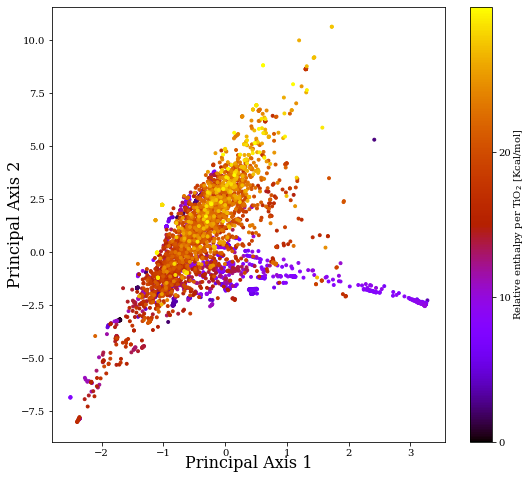

How-to: use the `asaplib` library
==================================

Example on quick analyisis of atomic coordinates using a SOAP based metric
**************************************************************************

.. code:: ipython3

    import numpy as np
    %matplotlib inline

    import asaplib

load structures
---------------

.. code:: ipython3

    from asaplib.data import ASAPXYZ
    asapxyz = ASAPXYZ('P-20GPa/result-complete/combined.xyz', periodic=True) # periodic=False otherwise 

    # load the tags (optional, you can use these to annotate the structures)
    tags = np.loadtxt("P-20GPa/result-complete/ranking-complete", dtype="str")
    #  import some reference order parameter for the structures
    enthalpy = np.array(tags[:,3],float)

compute SOAP descriptors
------------------------

.. code:: ipython3

    # specify the parameters
    soap_spec = {'soap1': {'type': 'SOAP',
                           'cutoff': 4.0,
                           'n': 6,
                           'l': 6,
                           'atom_gaussian_width': 0.5,
                           'crossover': False,
                           'rbf': 'gto'
                          }
                }
    
    reducer_spec = {'reducer1': {
                              'reducer_type': 'average', # [average], [sum], [moment_average], [moment_sum]
                              'element_wise': False}
                   }
    
    desc_spec = {'avgsoap': {
                      'atomic_descriptor': soap_spec,
                      'reducer_function': reducer_spec}
                }

.. code:: ipython3

    # compute atomic descriptors only
    asapxyz.compute_atomic_descriptors(desc_spec_dict=soap_spec,
                                        sbs=[],
                                        tag='tio2-atomic',
                                        n_process=1)

.. code:: ipython3

    # if you want to retrieve the atomic descriptors computed earlier
    dm_atomic = asapxyz.fetch_computed_atomic_descriptors(['soap1'])

.. code:: ipython3

    # compute descriptors for the whole structures
    asapxyz.compute_global_descriptors(desc_spec_dict=desc_spec,
                                        sbs=[],
                                        keep_atomic=False, # set to True to keep the atomic descriptors
                                        tag='tio2',
                                        n_process=4)
    # can use asapxyz.fetch_computed_atomic_descriptors(['soap1']) if keep_atomic=True

Build a kernel Matrix
---------------------

.. code:: ipython3

    reduce_dict = {}
    reduce_dict['kpca'] = {"type": 'SPARSE_KPCA',
                            'parameter':{"n_components": 10,
                                         "n_sparse": -1, # no sparsification
                                    "kernel": {"first_kernel": {"type": 'linear'}}}}

kernel PCA on environmental similarity
--------------------------------------

.. code:: ipython3

    from asaplib.reducedim import Dimension_Reducers
    dreducer = Dimension_Reducers(reduce_dict)

.. code:: ipython3

    dm = asapxyz.fetch_computed_descriptors(['avgsoap'])

.. code:: ipython3

    proj = dreducer.fit_transform(dm)

Plot the result
---------------

.. code:: ipython3

    from asaplib.plot import Plotters

.. code:: ipython3

    fig_spec = { 'outfile': None,
                    'show': False,
                    'title': None,
                    'size': [8*1.1, 8],
                    'cmap': 'gnuplot',
                        'components':{
                        'first_p': {'type': 'scatter', 'clabel': 'Relative enthalpy per TiO$_2$ [Kcal/mol]',
                                    'vmin':None, 'vmax': None}
                        #'second_p': {"type": 'annotate', 'adtext': False} # for annotation 
                        }
                       }
        
    asap_plot = Plotters(fig_spec)
    
    plotcolor = enthalpy[:]
    asap_plot.plot(proj[:, [1,0]], plotcolor) 
    # one can use asap_plot.plot(proj[:, [1,0]], plotcolor, tags) to annotate the structures using the tags

.. parsed-literal::

    Using scatter plot ...

